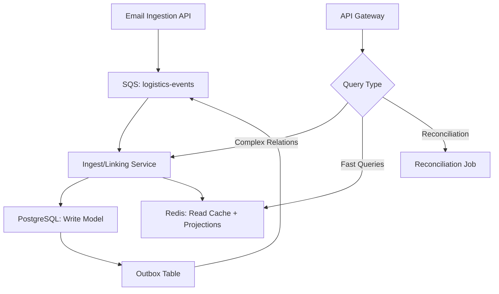
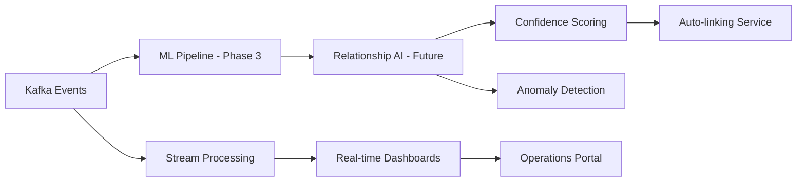
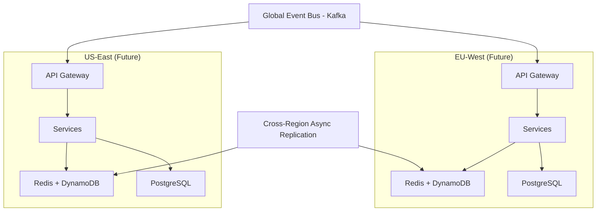

# 🏗️ Architecture Evolution: From Take-Home to Production

This document outlines the natural evolution path from the current take-home implementation to a production-ready, scalable architecture for logistics data processing.

## 📋 Current Implementation (Take-Home)

### Architecture Overview
```
┌─────────────────┐    ┌─────────────────┐    ┌─────────────────┐
│   REST API      │    │   Application   │    │   PostgreSQL    │
│  Controllers    │───▶│    Services     │───▶│   (JDBC)        │
└─────────────────┘    └─────────────────┘    └─────────────────┘
         │                       │
         │              ┌─────────────────┐
         │              │  SQS Consumer   │
         │              │   (Local/AWS)   │
         └──────────────▶└─────────────────┘
```

### Key Components
- **Hexagonal Architecture**: Clear separation of domain, application, and infrastructure
- **M:N Relationships**: `order_containers` table for flexible linking
- **Multi-tenant JWT**: Secure tenant isolation
- **SQS Processing**: Asynchronous email ingestion with retry/DLQ
- **Progressive Linking**: Smart relationship inference between orders and containers

### Strengths
✅ **Clean Architecture**: Domain-driven design with clear boundaries  
✅ **Type Safety**: Kotlin value classes with business validation  
✅ **Flexibility**: M:N relationships handle complex logistics scenarios  
✅ **Security**: JWT-based multi-tenancy with data isolation  
✅ **Resilience**: SQS with exponential backoff and dead letter queues  

### Limitations
⚠️ **Single Database**: All data in PostgreSQL limits scaling  
⚠️ **Synchronous Processing**: Complex linking operations block request threads  
⚠️ **No CQRS**: Read and write operations use the same data model  
⚠️ **Limited Analytics**: No time-series or analytical capabilities  

---

## 🚀 Production Evolution: Event-Driven CQRS Architecture

### Phase 1: CQRS Foundation (PostgreSQL + Redis)



### Core Benefits

#### 🎯 **Separation of Concerns**
```kotlin
// Single Service: Ingest and Linking with Outbox
@SqsListener("logistics-events")
class IngestLinkingService {
    @Transactional
    fun processEvent(event: LogisticsEvent) {
        // Business rule processing and relationship inference
        val result = processBusinessLogic(event)
        
        // Outbox pattern for eventual consistency
        outboxRepository.save(OutboxEvent(result))
        
        // Update read projections (materialized view or Redis)
        readProjectionService.updateProjection(result)
    }
}

// Separate Reconciliation Job
@Scheduled("0 */15 * * * *") // Every 15 minutes
class ReconciliationService {
    fun reconcileRelationships() {
        // Find and fix inconsistencies
        // Run confidence scoring updates
    }
}
```

#### ⚡ **Performance Optimization**
```kotlin
// Redis: Fast cached queries (target p95 < 20ms)
// Key pattern: tenant:{tenantId}:booking:{bookingRef}
fun findByBookingRef(tenantId: String, bookingRef: String): List<LogisticsItem> {
    return redis.get("tenant:$tenantId:booking:$bookingRef")
        ?: fallbackToPostgreSQL(tenantId, bookingRef)
}

// PostgreSQL: Complex analytical queries and writes
fun findPotentialMatches(similarity: Double): List<RelationshipCandidate>
fun generateComplianceReport(dateRange: DateRange): ComplianceReport

// Materialized View: Pre-computed aggregations
CREATE MATERIALIZED VIEW tenant_booking_summary AS
SELECT tenant_id, booking_ref, COUNT(*) as total_containers
FROM order_containers GROUP BY tenant_id, booking_ref;
```

### Phase 2: Kafka + Advanced Analytics (Future)



#### 🤖 **Machine Learning Integration (Phase 3 - Future Exploration)**
```kotlin
class IntelligentLinkingService {
    fun inferRelationships(context: LogisticsContext): List<RelationshipSuggestion> {
        return when {
            // Rule 1: Exact booking match (confidence: 1.0)
            hasMatchingBooking(context) -> exactBookingMatch(context)
            
            // Rule 2: Temporal correlation (confidence: 0.8)
            hasTemporalProximity(context) -> temporalMatch(context)
            
            // Future: ML-based inference when data volume justifies it
            // hasMLSignals(context) -> mlBasedMatch(context)
            
            else -> emptyList()
        }
    }
}
```

#### 📊 **Real-time Analytics**
```kotlin
// Stream processing for operational insights
@StreamProcessor("logistics-metrics")
class OperationalMetricsProcessor {
    fun process(event: LogisticsEvent): Metrics {
        return Metrics(
            processingLatency = event.timestamp - event.receivedAt,
            linkingAccuracy = calculateLinkingAccuracy(event),
            dataQualityScore = assessDataQuality(event),
            tenantThroughput = calculateThroughput(event.tenantId)
        )
    }
}
```

### Phase 3: Multi-Region (Future - Active-Active)



---

## 🔄 Migration Strategy

### Step 1: Dual Write Pattern
```kotlin
class HybridOrderContainerRepository : OrderContainerRepository {
    override fun linkOrderAndContainer(/* params */): OrderContainer {
        // Write to existing PostgreSQL (primary)
        val result = legacyRepository.linkOrderAndContainer(params)
        
        // Async write to new event stream (shadow)
        eventPublisher.publishLinkingEvent(result)
        
        return result
    }
}
```

### Step 2: Event Sourcing Migration
```kotlin
@EventReplayService
class MigrationService {
    fun replayHistoricalData(dateRange: DateRange) {
        // Read existing PostgreSQL data
        val relationships = legacyRepository.findAllInRange(dateRange)
        
        // Generate synthetic events
        relationships.forEach { relationship ->
            val event = LogisticsEvent.fromLegacyData(relationship)
            eventStore.append(event)
        }
    }
}
```

### Step 3: Gradual Cutover
```kotlin
class FeatureFlaggedRepository : OrderContainerRepository {
    override fun findOrdersByContainerRef(/* params */): List<Order> {
        return if (featureFlags.isEnabled("use-event-sourced-queries", tenantId)) {
            newEventSourcedRepository.findOrdersByContainerRef(params)
        } else {
            legacyRepository.findOrdersByContainerRef(params)
        }
    }
}
```

---

## 📈 Scalability Metrics

### Current vs Target Performance

| Metric | Current (Take-Home) | Target (Production) |
|--------|-------------------|-------------------|
| **Query Latency** | 50-200ms | Target p95 < 20ms |
| **Write Throughput** | ~100 ops/sec | Target ~1,000-5,000 ops/sec |
| **Concurrent Users** | ~100 | Target 10,000+ |
| **Data Volume** | ~1M relationships | Scale to 100M+ relationships |
| **Availability** | 99.9% | Target 99.95%+ |
| **Recovery Time** | ~10 minutes | Target < 2 minutes |

### Cost Optimization

```yaml
# Current Infrastructure
PostgreSQL: ~$500/month (single instance)
SQS: ~$50/month
EC2: ~$200/month
Total: ~$750/month

# Phase 1 Target Infrastructure  
PostgreSQL: ~$400/month (with read replicas)
Redis: ~$200/month (managed cache)
SQS: ~$100/month (higher volume)
EC2: ~$300/month (load balanced)
Total: ~$1000/month (moderate increase for significant capacity boost)

# Future phases would add Kafka, DynamoDB as needed
```

---

## 🛡️ Operational Excellence

### Monitoring & Observability
```kotlin
@Component
class LogisticsMetrics {
    
    @Timed("relationship.linking.duration")
    @Counted("relationship.linking.attempts")
    fun linkEntities(order: Order, container: Container) {
        // Implementation with automatic metrics
    }
    
    @EventListener
    fun onLinkingFailure(event: LinkingFailureEvent) {
        alertManager.sendAlert(
            severity = if (event.confidence > 0.8) HIGH else MEDIUM,
            message = "High-confidence linking failed: ${event.reason}"
        )
    }
}
```

### Data Quality Monitoring
```kotlin
@Scheduled("0 */5 * * * *") // Every 5 minutes
class DataQualityMonitor {
    fun assessDataQuality() {
        val metrics = DataQualityMetrics(
            orphanedContainers = countOrphanedContainers(),
            duplicateBookings = findDuplicateBookings(),
            missingMandatoryFields = validateMandatoryFields(),
            linkingAccuracy = calculateLinkingAccuracy()
        )
        
        metricsPublisher.publish(metrics)
    }
}
```

---

## 🎯 Business Value Proposition

### Immediate Benefits (Phase 1)
- **Improved query performance** with Redis caching (target 2-5x faster)
- **Higher throughput** for data ingestion (target 5-10x current capacity)
- **Zero-downtime deployments** with blue-green strategy
- **Better resilience** with read replicas and caching

### Medium-term Benefits (Phase 2)  
- **AI-driven insights** for logistics optimization
- **Predictive analytics** for supply chain planning
- **Real-time dashboards** for operational visibility
- **Compliance automation** for regulatory requirements

### Long-term Benefits (Phase 3)
- **Global multi-region** deployment
- **Unlimited horizontal scaling**
- **Advanced ML/AI capabilities**
- **Ecosystem integration** with partners

---

## 💡 Key Takeaways

### For the Take-Home Discussion
1. **Current implementation demonstrates solid architectural foundations**
2. **M:N relationship model provides necessary flexibility**
3. **Event-driven evolution is a natural next step**
4. **CQRS pattern addresses both consistency and performance**
5. **Migration strategy minimizes business risk**

### Technical Decision Rationale
- **PostgreSQL**: Chosen for ACID compliance and complex queries
- **DynamoDB**: Selected for low-latency, high-scale read operations  
- **Kafka**: Event backbone for reliable, ordered message processing
- **Hybrid approach**: Gradual migration reduces implementation risk

This evolution demonstrates how a well-architected take-home solution naturally scales to handle enterprise-grade logistics requirements while maintaining the core domain model and business logic.